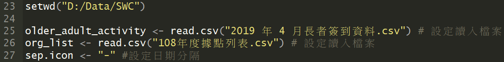
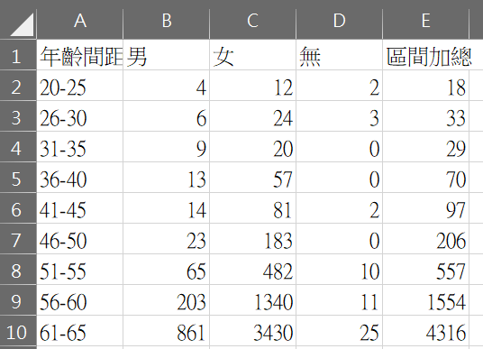

# 儀表版資料前處理腳本說明

- ### 腳本使用說明:
1. 下載腳本至本機後，請使用R-Studio打開檔案並先安裝以下R套件:
	


	
2. 請使用R之指令列鍵入安裝套件之函數，引號內輸入套件名稱，並執行安裝套件，Ex:
	
```R
install.pakages("tidyr")
```

3. 待套件安裝好後，還需在執行前修改本機路徑及需要讀入之資料(黃色部分):
	


	
4. 最後按下腳本列右上角之Source鍵執行程式:
	


------

- ### 執行 SW_code_all.R 腳本共會輸出7個.xlsx檔案:
	
1. first_gragh.xlsx (年齡間距分布):
	


	
2. gender_over60.xlsx (性別人數):
	


	
3. second_graph.xlsx檔案 (各類型使用人次人數): 
	


	
4. Third_graph.xlsx (各區據點數及使用人次人數):
	


	
5. Third_graph_org.xlsx (各據點使用人次人數):	
	


	
6. freqGraph.xlsx (各行政區據點一周平均刷卡人數): 
	


7. data_for_analysis.xlsx (清理後用於分析的資料)
